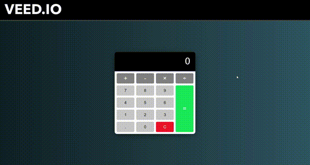

<!-- Improved compatibility of back to top link: See: https://github.com/othneildrew/Best-README-Template/pull/73 -->

<!--
*** Thanks for checking out the Best-README-Template. If you have a suggestion
*** that would make this better, please fork the repo and create a pull request
*** or simply open an issue with the tag "enhancement".
*** Don't forget to give the project a star!
*** Thanks again! Now go create something AMAZING! :D
-->

<!-- PROJECT SHIELDS -->
<!--
*** I'm using markdown "reference style" links for readability.
*** Reference links are enclosed in brackets [ ] instead of parentheses ( ).
*** See the bottom of this document for the declaration of the reference variables
*** for contributors-url, forks-url, etc. This is an optional, concise syntax you may use.
*** https://www.markdownguide.org/basic-syntax/#reference-style-links
-->

<!-- PROJECT LOGO -->
 

  

<h3 align="center">Vanilla Calculator</h3>

  

    A Modern looking Calculator built with Vanilla JavaScript 🖩
     
    <a href="https://github.com/Prasenjit-3433/CalculatorJs"><strong>Explore the docs »</strong></a>
     
     
    <a href="https://ztmcalculatorjs.netlify.app/">View Demo</a>
    ·
    <a href="https://github.com/Prasenjit-3433/CalculatorJs/issues">Report Bug</a>
    ·
    <a href="https://github.com/Prasenjit-3433/CalculatorJs/issues">Request Feature</a>
  

<!-- ABOUT THE PROJECT -->
## 🙋 Screenshots of The Project

<!--   -->

  

## 🛠 Built With

* 
* 
* 
